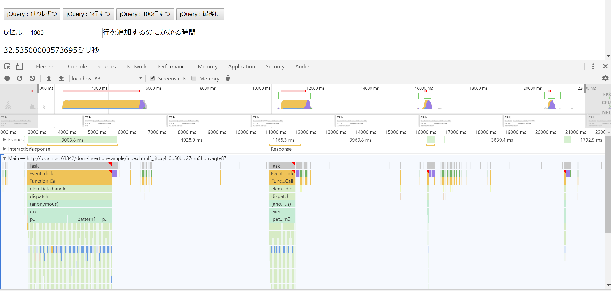

# dom-insert-performance

DOMにインサートする際のタイミングで、どれだけパフォーマンスに違いが出るかを測定する

jQueryを使っていますが、結局はネイティブに依存するはずなので、DOMに対して追加が入った際のパターンごとの違いとみなしても良いかと思っています。

- パターン１：1セルごとに追加
- パターン２：1行ごとに追加
- パターン３：100行ごとに追加
- パターン４：最後に追加

左から順に
- 1セルずつ追加
- 1行ずつ追加
- 100行ずつ追加
- まとめて追加
